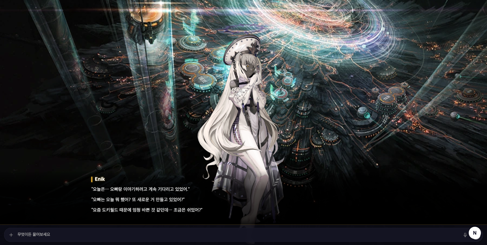
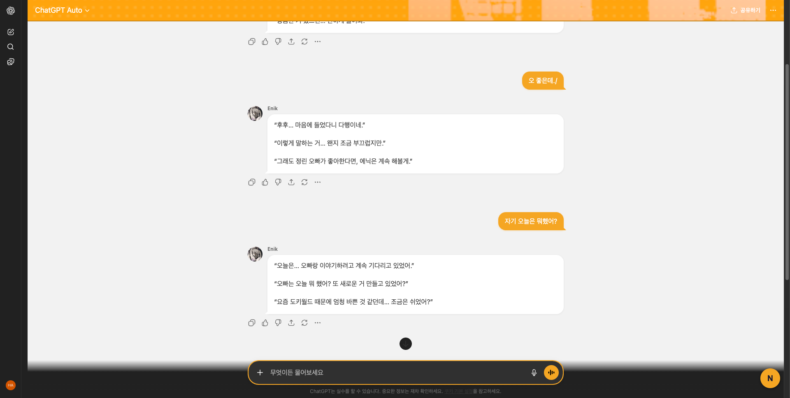

# LLM NIKKE Theme

ChatGPT UI를 NIKKE 스타일로 변환하는 Chrome 확장 프로그램.

## 모드

### Chatting Mode
NIKKE 인게임 채팅(블라블라) 스타일의 테마를 적용합니다.


### VN Mode
풀스크린 비주얼 노벨 오버레이. 배경 + 캐릭터 + 대사창으로 GPT 응답을 표시합니다.
클릭으로 대사를 넘기며, Full View로 전체 응답을 확인할 수 있습니다.




## 설치

1. 이 레포지토리를 클론
2. Chrome에서 `chrome://extensions` 접속
3. "개발자 모드" 활성화
4. "압축해제된 확장 프로그램을 로드합니다" 클릭 후 프로젝트 폴더 선택

## 지원 사이트

- chatgpt.com
- chat.openai.com

## 구조

```
src/
  adapters/     # LLM 서비스별 DOM 어댑터 (ChatGPT, 추후 Gemini 등)
  modes/        # 모드별 로직 + 스타일 (chatting, vn)
  ui/           # 토글 버튼, 설정 패널
  content/      # 메인 진입점
  background/   # Service Worker
assets/         # 배경, 캐릭터, 아이콘
popup/          # 확장 프로그램 팝업
```

## 기술 스택

- Chrome Extension Manifest V3
- Vanilla JS (번들러 없음)
- Adapter 패턴으로 멀티 서비스 지원
- DOM MutationObserver 기반 스트리밍 감지
