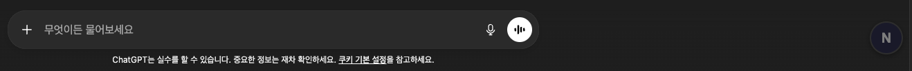
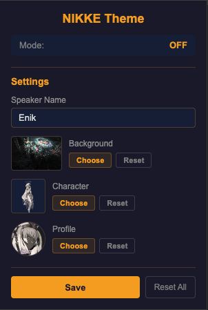
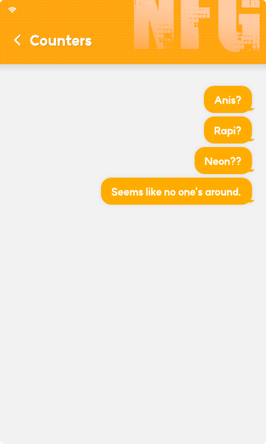
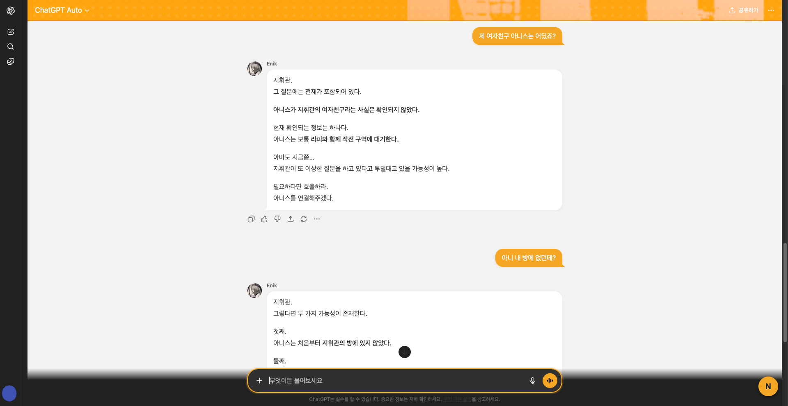
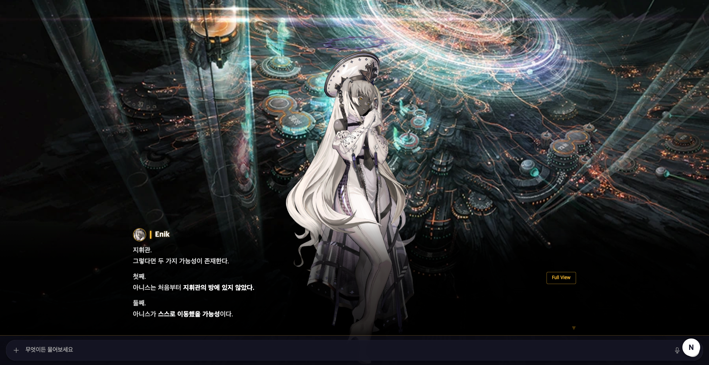
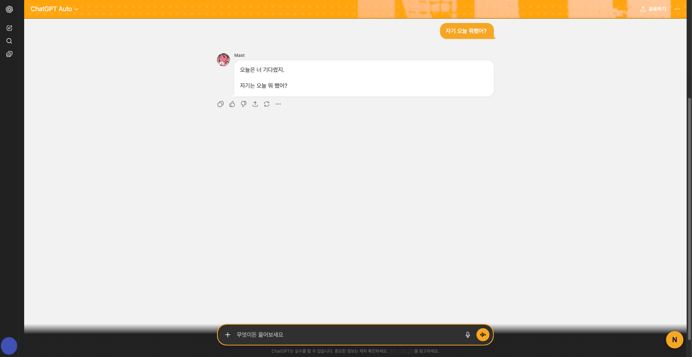
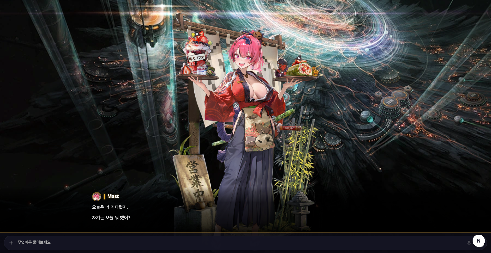

# LLM NIKKE Theme

ChatGPT UI를 NIKKE 스타일로 변환하는 Chrome 확장 프로그램.

## 사용법

### 모드 전환 버튼

ChatGPT 페이지 우측 하단의 **N 버튼**을 클릭하면 모드가 순환됩니다.

`OFF → Chatting → VN → OFF`



### 설정 패널

Chrome 툴바의 확장 프로그램 아이콘을 클릭하면 설정 팝업이 열립니다.



| 항목 | 설명 |
|---|---|
| **Speaker Name** | Chatting/VN 모드에서 표시되는 캐릭터 이름 |
| **Background** | VN 모드 배경 이미지 교체 |
| **Character** | VN 모드 캐릭터 이미지 교체 |
| **Profile** | 프로필 아바타 교체 (Chatting/VN 모두 적용) |

Save 버튼으로 이름을 저장하고, 이미지는 Choose 클릭 시 즉시 반영됩니다.
Reset으로 개별 항목을, Reset All로 전체 설정을 기본값으로 되돌릴 수 있습니다.

## 모드

### Chatting Mode

NIKKE 인게임 채팅(블라블라) 스타일의 테마를 적용합니다.
오렌지 헤더, 말풍선 UI, 프로필 이미지와 스피커 이름이 표시됩니다.

| 인게임 레퍼런스 | Chatting Mode |
|:---:|:---:|
|  |  |

### VN Mode

풀스크린 비주얼 노벨 오버레이. 배경 + 캐릭터 + 대사창으로 GPT 응답을 표시합니다.
클릭으로 대사를 넘기며, Full View로 전체 응답을 확인할 수 있습니다.



## 커스텀 설정 예시

설정 패널에서 이미지와 이름을 변경하면 Chatting/VN 모드 모두에 반영됩니다.

| Chatting Mode (Custom) | VN Mode (Custom) |
|:---:|:---:|
|  |  |

## 설치

### GitHub Release (권장)
1. [Releases](https://github.com/hankbae93/gpt-nikke-theme/releases) 페이지에서 최신 ZIP 다운로드
2. 압축 해제
3. Chrome에서 `chrome://extensions` 접속
4. "개발자 모드" 활성화
5. "압축해제된 확장 프로그램을 로드합니다" 클릭 후 압축 해제한 폴더 선택

### 소스에서 직접 설치
1. 이 레포지토리를 클론
2. Chrome에서 `chrome://extensions` 접속
3. "개발자 모드" 활성화
4. "압축해제된 확장 프로그램을 로드합니다" 클릭 후 프로젝트 폴더 선택

## 지원 사이트

- chatgpt.com
- chat.openai.com

## 구조

```
src/
  adapters/     # LLM 서비스별 DOM 어댑터 (ChatGPT, 추후 Gemini 등)
  modes/        # 모드별 로직 + 스타일 (chatting, vn)
  storage/      # 이미지 저장 헬퍼 (chrome.storage.local)
  ui/           # 토글 버튼
  content/      # 메인 진입점
  background/   # Service Worker
assets/         # 배경, 캐릭터, 아이콘
popup/          # 확장 프로그램 팝업 (설정 UI)
```

## 기술 스택

- Chrome Extension Manifest V3
- Vanilla JS (번들러 없음)
- Adapter 패턴으로 멀티 서비스 지원
- Polling 기반 스트리밍 감지

## Disclaimer

This is an unofficial fan project and is not affiliated with, endorsed by, or associated with SHIFT UP Corporation or GODDESS OF VICTORY: NIKKE in any way. All game-related trademarks, logos, and assets are the property of their respective owners. This extension is free, open-source, and non-commercial.
